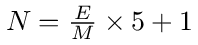
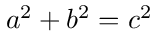
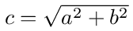
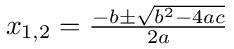
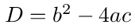
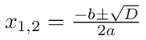
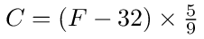
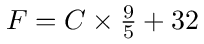

# Aufgaben

Die folgenden Aufgaben können Sie direkt in die angegebene Datei lösen. Beachten
Sie hierzu die `// TODO: `-Kommentare im Code und die folgenden Instruktionen:

## Note berechnen

`go-4-ex-1/main.go`: Eine Note `N` von 1 (schlechteste) bis 6 (beste) kann
linear anhand der erreichten Punktzahl `E` und maximalen Punktezahl `M`
berechnet werden:



Schreiben Sie eine Funktion namens `computeGrade`, welche die beiden Parameter
`gotPoints` (erreichte Punktzahl) und `maxPoints` (maximale Punktzahl) erwartet
und eine Note im Bereich `[1.0;6.0]` zurückgibt.

Rufen Sie die Funktion dreimal mit verschiedenen Werten auf und schreiben Sie
das Ergebnis als Kommentar hinter den jeweiligen Funktionsaufruf, z.B.:

    computeGrade(17.5, 28.0) // 4.125

### Zusatzaufgabe

Erweitern Sie die Funktion `computeGrade`, sodass sie auf sinnlose Argumente
reagiert (z.B.  negative Punktzahlen, mehr Punkte erreicht als möglich) und
einen entsprechenden `error` zurückgibt. Passen Sie Ihre Funktionsaufrufe
entsprechend an, um auf Fehler reagieren zu können.

## Hypotenuse berechnen

`go-4-ex-2/main.go`: Der Satz vom Pythagoras ist definiert als:



Stellt man die Formel auf `c` um, kann man mit der Formel die Länge der
Hypotenuse bei gegebenen Kathetenlängen berechnen:



Schreiben Sie eine Funktion namens `computeHypotenuse`, welche die beiden
Kathetenlängen `a` und `b` als Parameter erwartet und die Länge der Hypotenuse
zurückgibt.

Tipp: Verwenden Sie die Funktion [`math.Pow`](https://pkg.go.dev/math#Pow) und
[`math.Sqrt`](https://pkg.go.dev/math#Sqrt) für die Berechnung.

Testen Sie die Funktion mit verschiedenen Kathetenlängen und dokumentieren Sie
die Aufrufe wie bei Aufgabe 1 mit Kommentaren.

### Zusatzaufgabe

Die beiden Kathetenlängen `a` und `b` können zu einem neuen Typ namens
`ShortSides` gruppiert werden:

```go
type ShortSides struct {
    a float64
    b float64
}
```

Schreiben Sie eine _Methode_ `Hypotenuse`, welche auf `ShortSides` operiert und
keine weiteren Parameter erwartet.

Testen Sie die Methode mit den gleichen Kathetenpaaren wie `computeHypotenuse`
und notieren Sie sich die Ergebnisse als Kommentare hinter den Methodenaufrufen.

## Quadratische Gleichungen lösen

`go-4-ex-3/main.go`: Quadratische Gleichungen der Form `ax² + bx + c = 0` lassen sich
mithilfe der sogenannten _Mitternachtsformel_ lösen:



Den Teil unter der Wurzel bezeichnet man als _Diskriminante_:



Je nach Wert der Diskriminante `D` gibt es eine unterschiedliche Anzahl an Lösungen:

- `D > 0`: zwei Lösungen
- `D = 0`: eine Lösung
- `D < 0`: keine Lösung

Schreiben Sie eine Funktion namens `computeQuadraticFormula`, welche die
Parameter `a`, `b` und `c` erwartet, und ein Slice mit den berechneten Lösungen
zurückgibt.

Tipp: Verwenden Sie die Funktion [`math.Pow`](https://pkg.go.dev/math#Pow) und
[`math.Sqrt`](https://pkg.go.dev/math#Sqrt) für die Berechnung.

Rufen Sie die Funktion dreimal auf, sodass je ein Ergebnis mit zwei Lösungen,
mit einer Lösung und ohne Lösung entsteht. Dokumentieren Sie die Ergebnisse
wiederum als Kommentare. Sie können hierzu die folgenden Testdaten verwenden:

| D | a | b | c |
|--:|--:|--:|--:|
| + | 3 | 4 | 1 |
| 0 | 2 | 4 | 2 |
| - | 3 | 4 | 2 |

### Zusatzaufgabe

Lagern Sie die Berechnung der Diskriminanten in eine eigene Funktion
namens `computeDiscriminant` aus. Testen Sie die Funktion separat mit den
Testdaten von vorher und dokumentieren Sie die Ergebnisse als Kommentar.

Schreiben Sie anschliessend die Funktion `computeQuadraticFormula` so um, dass
sie zur Berechnung die Funktion `computeDiscriminant` verwendet:



## Temperaturumrechnungen durchführen

`go-4-ex-4/main.go`: Schreiben Sie zwei Funktionen `convertCelsiusToFahrenheit`
und `convertFahrenheitToCelsius`, welche Temperaturangaben von Celsius (`C`)
nach Fahrenheit (`F`) bzw. von Fahrenheit nach Celsius umrechnen. Verwenden Sie
hierzu folgende Formeln:





Rufen Sie `convertCelsiusToFahrenheit` mit drei verschiedenen Werten auf und
dokumentieren Sie die Ergebnisse als Kommentar.

Rufen Sie anschliessend `convertFahrenheitToCelsius` mit den Ergebnissen von
vorher auf, sodass Sie wieder die ursprüngliche Angabe in Celsius erhalten
sollten.

### Zusatzaufgabe

Gegeben sind folgende Typen:

```go
type Celsius float64
type Fahrenheit float64
```

Schreiben Sie zwei Methoden `ConvertToFahrenheit` und `ConvertToCelsius` für
`Celsius` bzw. `Fahrenheit`, sodass folgende Aufrufe möglich werden:

```go
var cozy Celsius = 23.0
cozy.ConvertToFahrenheit()

var cold Fahrenheit = 15.3
cold.ConvertToCelsius()
```

Testen Sie die Methoden mit den Daten von vorher und dokumentieren Sie die
Ergebnisse als Kommentare.

Zusatzfrage: Welche Notation finden Sie übersichtlicher?

```go
fmt.Println(convertFahrenheitToCelsius(convertCelsiusToFahrenheit(23.0)))
```

Oder:

```go
var c Celsius = 23
fmt.Println(c.ConvertToFahrenheit().ConvertToCelsius())
```

